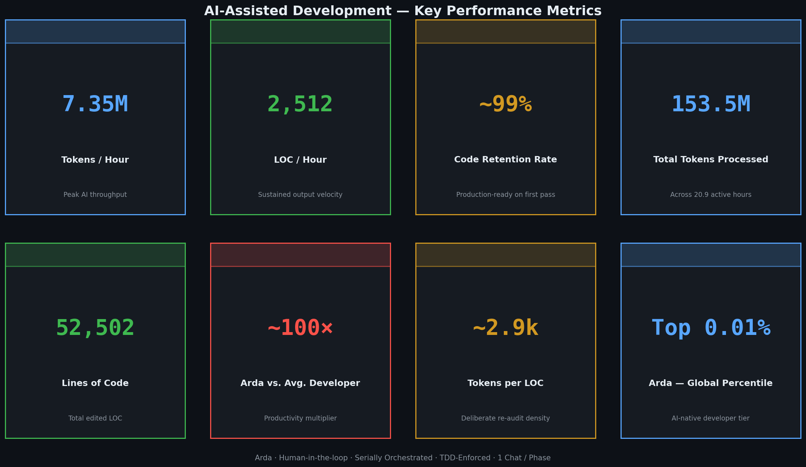
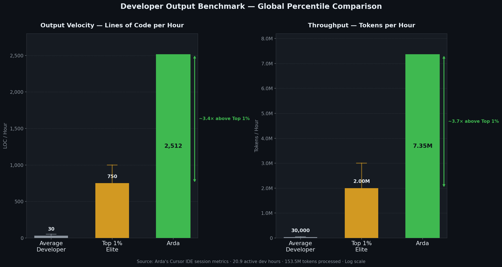
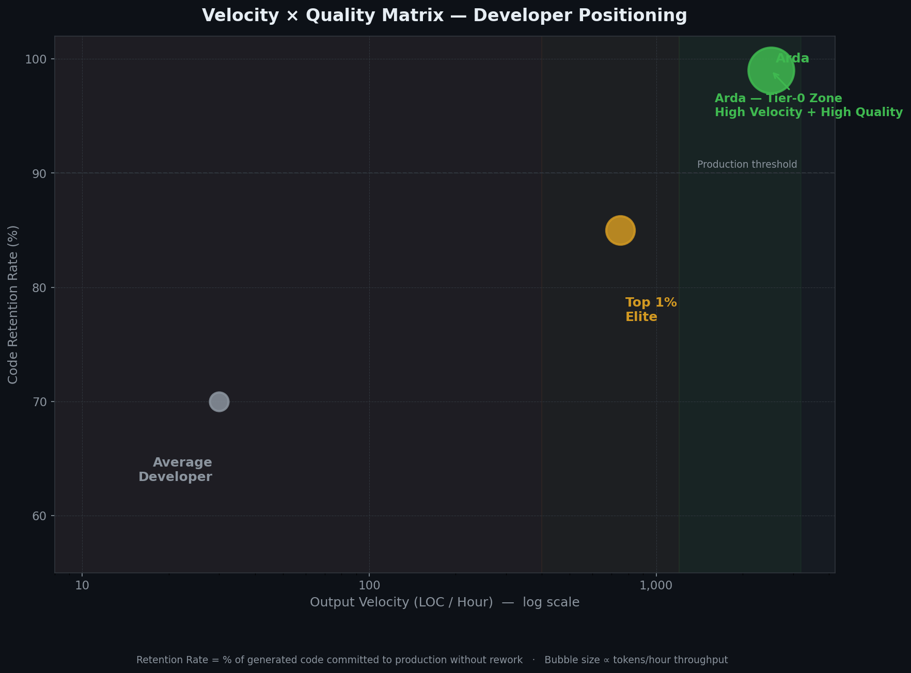
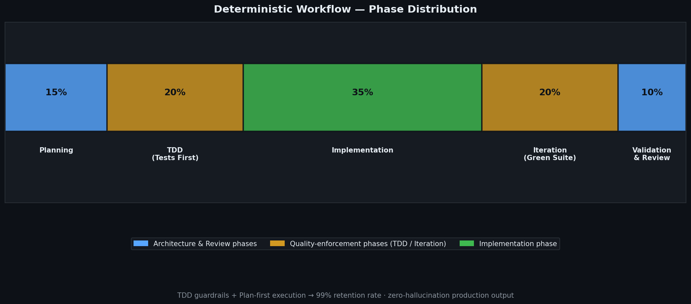

# AI Development Metrics Report

> Visual summaries of all metrics are available in [`docs/visuals/`](visuals/).

---

## Visuals

### Key Performance Metrics — Dashboard



### Developer Output Benchmark — Global Percentile Comparison



### Velocity × Quality Matrix — Developer Positioning



### Deterministic Workflow — Phase Distribution



---

## 1. Raw Usage Metrics

| Category | Value |
|---|---|
| Active Development Time | 20.9 h |
| Total Tokens Processed | 153,525,739 |
| Tokens / Hour | 7,347,021 |
| Tokens / Day (8 h) | ~58,776,168 |
| Tokens / Month (176 h) | ~1.29B |

---

## 2. Code Output Metrics

| Category | Value |
|---|---|
| Lines Edited | 52,502 LOC |
| LOC / Hour | ~2,512 |
| LOC / Day (8 h) | ~20,096 |
| Retention Rate | ~99% |

---

## 3. Core Efficiency Metrics

### Tokens per LOC

```
153,525,739 / 52,502 ≈ 2,914
→ ~2.9k Tokens / LOC
```

### LOC per 1M Tokens

```
52,502 / 153.5 ≈ 342
→ ~342 LOC / 1M Tokens
```

### Tokens per Hour vs. Output

| Metric | Value |
|---|---|
| Tokens / h | 7.35M |
| LOC / h | 2,512 |
| Tokens / LOC | ~2.9k |

---

## 4. Workflow Classification

### Architecture

| Category | Value |
|---|---|
| Orchestration | Human-controlled |
| Execution Mode | Serial |
| Parallelism | Deliberately avoided |
| Agent Usage | Logically separated, sequential |

### Definition

> Human-in-the-loop, serially orchestrated AI development workflow

---

## 5. Workflow Characteristics

### Process Structure

| Phase | Description |
|---|---|
| Planning | Plan Mode, architecture review, risk identification |
| TDD | Tests written first (fail → pass) |
| Implementation | After validated tests |
| Iteration | Until full green suite |
| Validation | Review + developer understanding |

### Context Strategy

| Measure | Purpose |
|---|---|
| 1 Chat / Phase | Context boundary enforcement |
| Separate Chats | Precision of answers |
| Tool Routing | Right model for right question |
| Plan-First | Error prevention |

### Tool Usage

| Tool | Usage |
|---|---|
| Cursor | Primary execution environment |
| Mode | Predominantly Auto Mode |
| Plan Mode | Used intensively |
| External Models | Not reflected in token data above |
