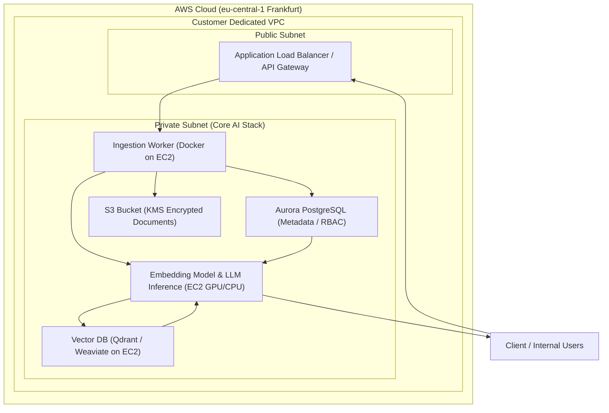
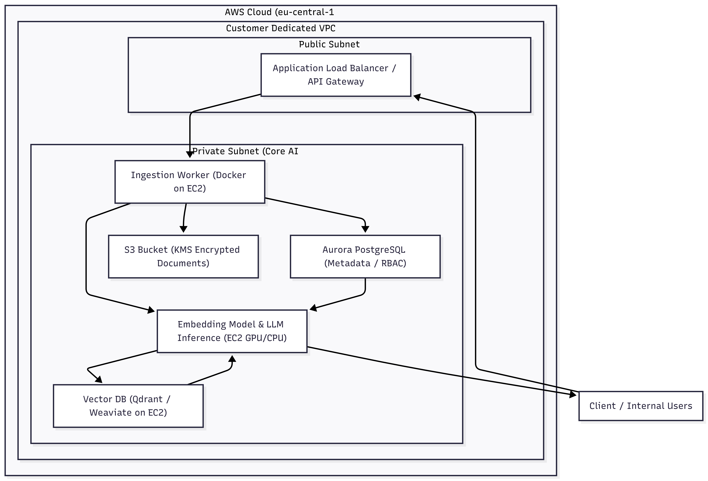

# Dedicated RAG Deployment per Customer (IaaS / Enterprise Knowledge AI)

## 1. Executive Summary

A fully isolated per-customer AWS deployment eliminates cross-tenant data leakage by design, replacing logical multi-tenancy with physically separated VPC environments. This architecture meets strict GDPR, data residency, and confidentiality requirements for regulated industries (Legal, Biopharma) while enabling production-grade RAG performance.

## 2. Visual Architecture Diagram (Mermaid)

Static preview (PDF, slides, or viewers without Mermaid):

## 3. Core Architecture & Component Breakdown

### Document Ingestion Flow

| Step | Component | Technical Detail |
|------|-----------|------------------|
| 1 | S3 (KMS) | Documents uploaded via pre-signed URLs → encrypted at rest (KMS) |
| 2 | Ingestion Worker (EC2 + Docker) | Async worker (Python) pulls from S3 events / queue |
| 3 | Chunking | Token-aware chunking (e.g. 256–1024 tokens, overlap 10–20%) |
| 4 | Embeddings | SentenceTransformers / E5 models → vector generation |
| 5 | Vector Storage | Stored in Qdrant or Weaviate (HNSW index, cosine similarity) |
| 6 | Metadata | Stored in Amazon Aurora PostgreSQL (document ID, ACL, versioning) |

### Query / RAG Flow

1. User query → API Gateway / ALB
2. Query embedding generated (same model as ingestion)
3. Top-K retrieval from Vector DB (semantic search)
4. Metadata + access control resolved via Aurora (RBAC enforcement)
5. Context assembly → passed to LLM inference service (EC2)
6. Response returned with grounded context

## 4. Security & Tenant Isolation (Compliance-by-Design)

**Core principle:** Physical isolation over logical isolation.

| Layer | Implementation | Security impact |
|-------|----------------|-----------------|
| Compute isolation | Dedicated VPC per customer | No shared runtime, no lateral movement risk |
| Network segmentation | Public + private subnets | Zero direct access to core services |
| Identity | Fine-grained IAM roles per service | Least-privilege enforcement |
| Data storage | S3 + KMS (per-tenant keys) | Cryptographic isolation |
| Database | Dedicated Aurora cluster per tenant | No shared schemas |
| Vector DB | Single-tenant Qdrant/Weaviate instance | No embedding leakage |
| CI/CD | GitLab pipelines deploy per-customer infra | Deterministic, reproducible environments |

### Why this beats SaaS multi-tenancy

- No risk of cross-tenant data exposure via query bugs or embedding collisions
- Meets strict requirements such as professional secrecy (Art. 203 StGB), GDPR Art. 32, and data residency
- Enables on-prem or dedicated AWS account deployments for high-security clients
- Simplifies compliance audits: each customer = isolated system boundary

### Key takeaway

This architecture treats each customer as an independent AI system — turning RAG from a SaaS feature into secure enterprise infrastructure.